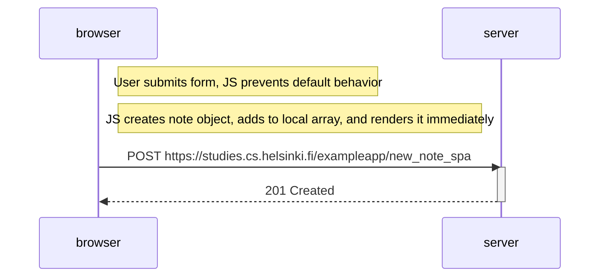

```mermaid
sequenceDiagram
    participant browser
    participant server
    
    Note right of browser: User submits form, JS prevents default behavior
    Note right of browser: JS creates note object, adds to local array, and renders it immediately
    
    browser->>server: POST https://studies.cs.helsinki.fi/exampleapp/new_note_spa
    activate server
    server-->>browser: 201 Created
    deactivate server
```